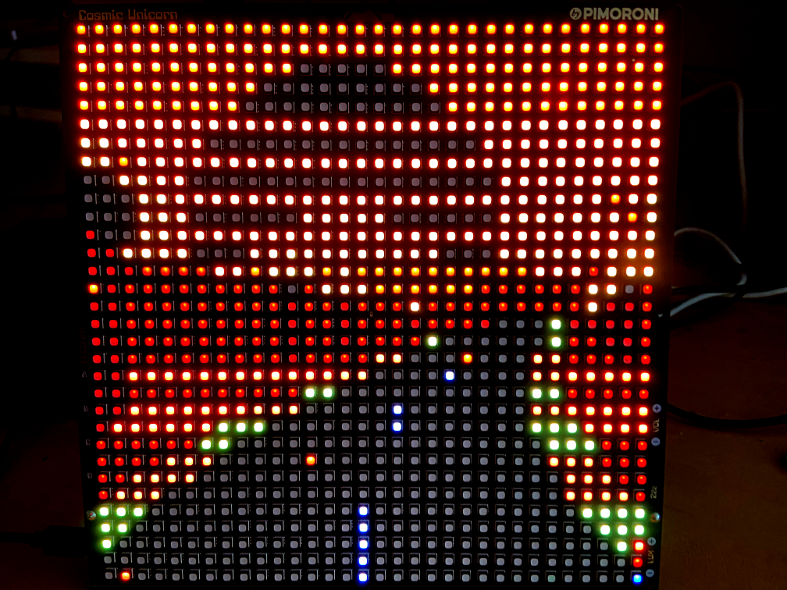

# CosmicArcadeRacer
80s style arcade racer for Pimoroni Cosmic Unicorn, written in micropython.


It's more of a screensaver / light show than a game, there's no points or times or anything, just a loose approximation of driving.
There are many different scenes to drive through. You don't have to drive, it has a self driving subscription so you can sit back 
and enjoy the ride if you want.  

The road is randomly generated, the terrain turns various assets on and off. You can make new themes fairly easily, sort of maybe.

It's hard to capture the dancing lights on camera well, but here is a couple of pictures of it in action:




[YouTube video of CosmicArcadeRacer in action on a Pimoroni Cosmic Unicorn ](https://www.youtube.com/watch?v=7CTsGtkukVQ)
https://www.youtube.com/watch?v=7CTsGtkukVQ


## Try without installing on the pico...
You can either run it from your computer using thonny / mpremote as you would anything else. 

eg:
```shell
mpremote run ./cosmic_arcade_racer.py 
```

### Install it to the Pico:
You have already done a pip install mpremote? Cool. 

...copy it up with mpremote cp and call it main.py if you want it to always start when you turn the cosmic unicorn (CU) on.

eg:
```shell
mpremote cp ./cosmic_arcade_racer.py :main.py
```

then restart your CU, however you like. One way is this, or use a button on it.
```shell
mpremote reset
```

Memory is tight so I have included a pre minified version if you want to save some space you could use that. 
Or use the deploy.sh script which will make a new minified version and save some space if you choose not to make your own.
 

